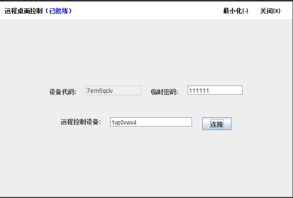
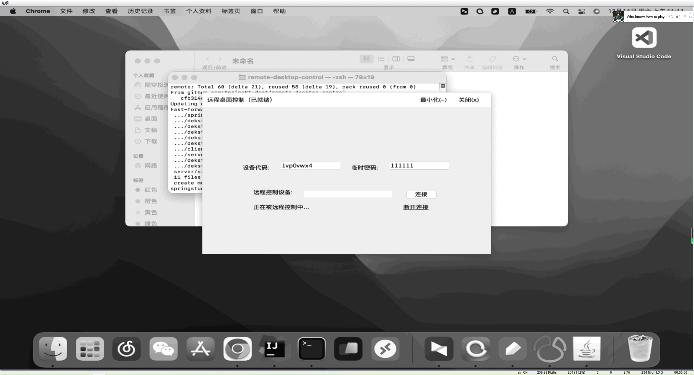
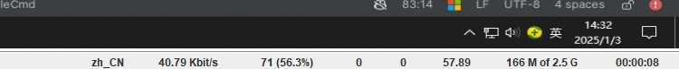
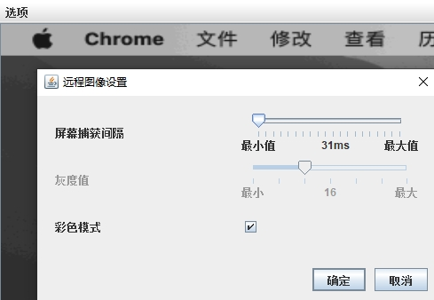
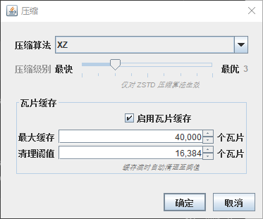
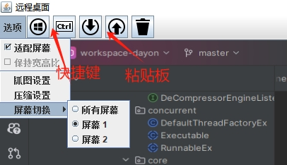

[English](README.md) | [中文](README_zh.md)

# Remote Desktop Control

基于 **Java** + **Netty** 的远程桌面控制系统。采用 client-server-client 中继模型，
局域网下自动建立 P2P 直连，兼顾低延迟与跨网段可达性。

基于 [Dayon](https://github.com/RetGal/Dayon) 代码重构为
client-server-client中继模型，并增加了 P2P 直连支持。

> 如果对帧率有更高要求，可查看另一个基于流媒体的远程桌面项目：
> [a-da](https://github.com/SpringStudent/a-da)

## 功能

| # | 功能 | 说明 |
|---|------|------|
| 1 | **实时远程控制** | 极低延迟的远程桌面操控 |
| 2 | **可定制捕获** | 可调捕获间隔、彩色/灰度模式 |
| 3 | **跨平台** | 纯 Java 实现，Windows / macOS / Linux 均可运行 |
| 4 | **剪贴板共享** | 双向文本 & 文件传输（HTTP 分块上传，无大小限制） |
| 5 | **多屏幕切换** | 实时选择并切换不同显示器画面 |
| 6 | **局域网 P2P 直连** | 同局域网下屏幕与键鼠数据自动点对点传输；直连失败/断开透明回退服务器中继 |
| 7 | **Zstd 压缩** | 可配压缩级别 1–9；局域网用 1 最快，广域网用高压缩比省带宽 |

## 架构

```
                          ┌────────────────────────────────┐
                          │ MySQL (Clipboard / File Meta)  │
                          └───────────┬─────────┬──────────┘
                                     │         │
                          ┌────────────────────────────────┐
                          │    Server HTTP API (12345)     │
                          │      /clipboard/save, /get     │
                          │  /file/uploadFileChunk, /download│
                          └───────────┬─────────┬──────────┘
                                     │         │
                                HTTP upload/download
                                     │         │
┌──────────────┐                   ┌─┴──────────┴─┐                   ┌──────────────┐
│  Controller  │ ◄───────────────► │    Server    │ ◄───────────────► │  Controlled  │
│              │ signaling + relay │   (Relay)    │ signaling + relay │              │
│              │                   │              │                   │              │
│ • render     │                   │ • register   │                   │ • capture    │
│ • input      │                   │ • route      │                   │ • compress   │
│ • P2P        │                   │ • pair       │                   │ • execute    │
│              │                   │              │                   │ • P2P        │
└──────┬───────┘                   └──────────────┘                   └──────┬───────┘
       │                                                                     │
       └─────────────────────────────────────────────────────────────────────┤
          P2P(LAN)screen / input / clipboard text — auto fallback to relay
                                                                             │ Socket
                                                                             ▼
                                                                       ┌────────────┐
                                                                       │   Robots   │
                                                                       │(lock scrn) │
                                                                       └────────────┘

  Robots is used only on Windows lock screen, called by Controlled via Socket.
  Clipboard: text over Netty (relay or P2P); file over HTTP (upload/download
  chunks via FileController, only the file ID is notified through Netty).
```

## 截图

### 启动面板



### 远程连接

  

### 设置菜单

    

## 运行环境

- **Java** 8 或更高版本
- **Maven** 依赖管理
- **MySQL** 用于剪贴板和文件元数据存储（仅服务端需要）

## 快速开始

### 1. 克隆 & 构建

```bash
git clone https://github.com/SpringStudent/remote-desktop-control
cd remote-desktop-control
mvn clean install
```

### 2. 启动服务端

将 `remote-desktop-control.sql` 导入 MySQL，然后修改 `application.properties`：

```properties
# 数据库
spring.datasource.url=jdbc:mysql://localhost:3306/remote_desktop_control
spring.datasource.username=root
spring.datasource.password=your_password

# Netty
netty.server.host=0.0.0.0
netty.server.port=54321
```

```bash
java -jar server/target/server-1.0.0.jar
```

### 3. 启动客户端

可通过命令行参数或外部配置文件指定连接信息：

```properties
# config.properties
serverIp=192.168.0.110
serverPort=54321
clipboardServer=http://192.168.0.110:12345/remote-desktop-control
robotPort=55678
# 可选 — P2P 直连; 不填则自动检测局域网地址并使用随机端口
p2pServerIp=192.168.1.100
p2pServerPort=55432
```

```bash
java -DconfigFile=/path/to/config.properties -jar client/target/RemoteClient.jar
```

## 演示

[](https://www.bilibili.com/video/BV11qNCeNEoZ/)

## 规划

- [x] 基于 HTTP 的剪贴板传输
- [x] 多屏幕切换支持
- [ ] 国际化 (i18n)

## FAQ

<details>
<summary><b>被控端为什么无法操控？</b></summary>

控制端和被控端均建议**以管理员权限运行**，否则部分程序可能因权限不足而无法操控。
</details>

<details>
<summary><b>为什么某些按键不生效？</b></summary>

将控制端的输入法语言首选项切换为 **「英语 (美国)」** 可获得最佳控制体验。
</details>

<details>
<summary><b>项目稳定性如何？</b></summary>

本项目稳定性已经过生产环境验证，可放心使用。
</details>

<details>
<summary><b>Windows 锁屏后无法抓图和模拟键鼠？</b></summary>

`java.awt.Robot` 在 Windows 锁屏场景下无法工作。配套使用
[windows-lock-helper](https://github.com/SpringStudent/windows-lock-helper)
和本项目的 **Robots** 模块可解决该问题。Robots 服务仅在 Windows 锁屏时需要启动，
非 Windows 系统无需启动。
</details>
